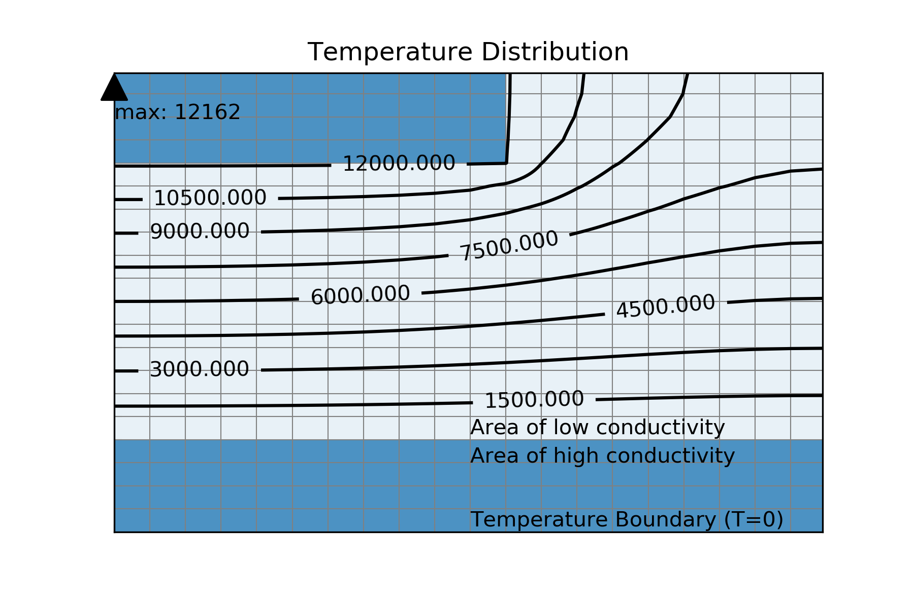

# The Finite Element Method: Examples with a Timoshenko Beam and Poisson's Equation

This project is a small example of coding the finite element method. The first 
coded example is to determine the modal frequencies of a Timoshenko cantilever.
The second solves Poisson't equation which models many physical phenomena. 

## Poisson's Equation

Poisson's equation results from modeling in many physcial domains including
heat conduction and electrostatics. The example coded in `poisson_fem.py` is 
used to determine the temperature field `T(x,y)` resulting from a set of 
heat sources `Q(x,y)` on a rectangular structure with varying heat conductivity
`k(x,y)`.

The coded example determines the temperature field over a rectangular domain
due to a heat source placed on a single element. An area through the middle
of the domain is given a lower heat conductivity. The solution is shown below.

Three different approaches to assembling are explored. By far the worst is
creating a block diagonal sparse matrix and then applying constraints. The
standard iterative method has good performance. However, an approach building
the contents of the sparse matrix using vector operations was the fastest.

## References

Matlab Codes for Finite Element Analysis; A. J. M. Ferreira; 2009; Springer;

Effecient topology optimization in MATLAB using 88 lines of code;
    Erik Andreassen, Anders Clausen, Mattias Schevenels, Boyan S. Lazarov,
    Ole Sigmund; Structural and Multidisciplinary Optimization; January 
    2011; Volume 43, Issue 1, pp 1–16;

The Finite Element Method for Electromagnetic Modelling; Gerard Meunier; 2008;
    Wiley;